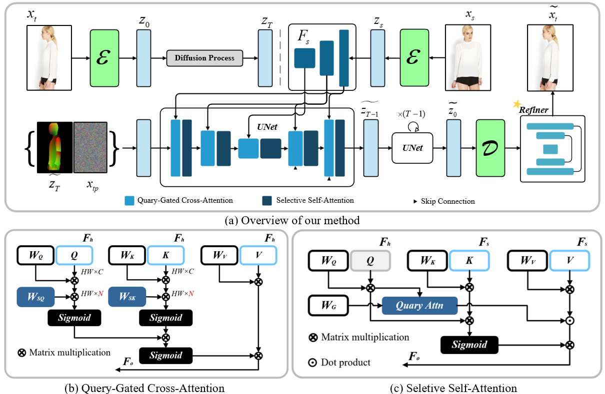

# Rethinking Information Propagation in Diffusion-Based Pose-Guided Human Image Synthesis

### 1. Dataset
- Download `img_highres.zip` of the DeepFashion Dataset from [In-shop Clothes Retrieval Benchmark](https://drive.google.com/drive/folders/0B7EVK8r0v71pYkd5TzBiclMzR00). 

- Unzip `img_highres.zip`. You will need to ask for password from the [dataset maintainers](http://mmlab.ie.cuhk.edu.hk/projects/DeepFashion/InShopRetrieval.html). Then unzip it and put it under the `./dataset/deepfashion` directory. 

- Download the train/test pairs from [Google Drive](https://drive.google.com/drive/folders/1PhnaFNg9zxMZM-ccJAzLIt2iqWFRzXSw?usp=sharing) including **train_pairs.txt**, **test_pairs.txt**, **train.lst**, **test.lst**. Put these files under the  `./dataset/deepfashion` directory. 

- You should have your dataset folder organized as follows:

```text
./dataset/deepfashion/
-- img
--- WOMEN
--- MEN
-- test.lst
-- train.lst
-- test_pairs.txt
-- train_pairs.txt
```

### 2. Generated Results && Pretrained Weight
    You can directly download our test results from [Google Drive]([https://drive.google.com](https://drive.google.com/drive/folders/1f5v4gxzPFzJYZcOMgBXJaakggTUlC3S7?usp=sharing)) (Including 256x176, 512*352 on Deepfashion) for further comparison. Besides, our pretained weight is available at[Google Drive](https://drive.google.com)

## 1. Environment Setup

Create a Conda environment with Python 3.10 and install the cu126 dependencies:

```powershell
conda create -n diffusion python=3.10 -y
conda activate diffusion
python -m pip install --upgrade pip
pip install -r requirements.txt
```

## 2. Method


The overall pipeline of our proposed two stage Model. (a) shows the structure of our work, which mainly composed of a diffusion-based unet and a transformer-based refiner. (b) shows the structure of proposed query-gated cross-attention that dynamically filters different part of human body. (c) shows the structure of proposed seletive self-attention that prevents invalid correlation in a dual-side gate manner. 

## 3. Train Diffusion

Single GPU:

```powershell
python -m new_diffusion.train --dataset_root dataset/deepfashion --resolution 512 --batch_size 6 --num_workers 8 --base_channels 256 --epochs 100 --sample_source_guidance_scale 3.0 --sample_pose_guidance_scale 3.0
```

Multi GPU:

```powershell
CUDA_VISIBLE_DEVICES=0,1 torchrun --nproc_per_node=2 -m new_diffusion.train --dataset_root dataset/deepfashion --resolution 512 --batch_size 3 --num_workers 8 --base_channels 256 --epochs 100 --sample_source_guidance_scale 3.0 --sample_pose_guidance_scale 3.0
```


## 4. Single Image Inference

Use this when you have one source image and one target densepose png.

```powershell
python -m new_diffusion.predict --checkpoint checkpoints/new_diffusion/last.pt --source test.jpg --pose dataset/deepfashion/densepose/WOMEN-Tees_Tanks-id_00000142-01_1_front_densepose.png --output outputs/new_diffusion.png --resolution 512 --sampler ddim --steps 50 --source_guidance_scale 3.0 --pose_guidance_scale 3.0
```

Use a BF16 checkpoint for lower inference memory:

```powershell
python -m new_diffusion.predict --checkpoint checkpoints/new_diffusion/last_bf16.pt --dtype bf16 --source test.jpg --pose dataset/deepfashion/densepose/WOMEN-Tees_Tanks-id_00000142-01_1_front_densepose.png --output outputs/new_diffusion_bf16.png --resolution 512 --sampler ddim --steps 50 --source_guidance_scale 3.0 --pose_guidance_scale 3.0
```

## 5. Batch Inference from a Pairs File

```powershell
python -m new_diffusion.predict --checkpoint checkpoints/new_diffusion/last.pt --dataset_root dataset/deepfashion --pairs_file test_pairs.txt --output_dir outputs/new_diffusion_test_pairs --resolution 512 --sampler ddim --steps 50 --source_guidance_scale 3.0 --pose_guidance_scale 3.0 --batch_size 16 --resume
```

For faster batch inference on 2 GPUs:

```powershell
CUDA_VISIBLE_DEVICES=0,1 torchrun --nproc_per_node=2 -m new_diffusion.predict --checkpoint checkpoints/new_diffusion/last.pt --dataset_root dataset/deepfashion --pairs_file test_pairs.txt --output_dir outputs/new_diffusion_test_pairs --resolution 512 --sampler ddim --steps 50 --source_guidance_scale 3.0 --pose_guidance_scale 3.0 --batch_size 16 --resume
```

Example for generating diffusion outputs on the training set:

```powershell
python -m new_diffusion.predict --checkpoint checkpoints/new_diffusion/last.pt --dataset_root dataset/deepfashion --pairs_file train_pairs.txt --output_dir outputs/new_diffusion_train_pairs --resolution 512 --sampler ddim --steps 50 --source_guidance_scale 3.0 --pose_guidance_scale 3.0 --batch_size 16
```

## 6. Evaluate Metrics from `test_pairs.txt`

Prepare training-set real images for FID. Use the FID-real directory that matches the evaluation resolution:

```powershell
python dataset/prepare_fid_real.py --dataset_root dataset/deepfashion --output_dir dataset/deepfashion/fid_real_256x176 --resolution 256 176
python dataset/prepare_fid_real.py --dataset_root dataset/deepfashion --output_dir dataset/deepfashion/fid_real_512x352 --resolution 512 352
```

Generate paired GT folders for evaluation. This creates both `outputs/gt/256` and `outputs/gt/512`:

```powershell
python dataset/prepare_gt.py --dataset_root dataset/deepfashion --pairs_file test_pairs.txt --output_dir outputs/gt
```

Evaluate `256x176` predictions:

```powershell
python evaluate.py --gt_path outputs/gt --img_path outputs/new_diffusion_test_pairs --training_path dataset/deepfashion --fid_real_path dataset/deepfashion/fid_real_256x176 --resolution 256
```

Evaluate `512x352` predictions:

```powershell
python evaluate.py --gt_path outputs/gt --img_path outputs/new_diffusion_test_pairs --training_path dataset/deepfashion --fid_real_path dataset/deepfashion/fid_real_512x352 --resolution 512
```

## 7. Train Refiner

```powershell
python -m Refiner.train_refiner --dataset_root dataset/deepfashion --pred_dir outputs/new_diffusion_train_pairs --pairs_file train_pairs.txt --val_pred_dir outputs/new_diffusion_test_pairs --val_pairs_file test_pairs.txt --resolution 512 --batch_size 4 --epochs 10 --lr 2e-4 --model_dim 24 --checkpoint_dir checkpoints/refiner --lpips_weight 0.2
```

Train with two GPUs:

```powershell
CUDA_VISIBLE_DEVICES=0,1 python -m torch.distributed.run --standalone --nproc_per_node=2 -m Refiner.train_refiner --dataset_root dataset/deepfashion --pred_dir outputs/new_diffusion_train_pairs --pairs_file train_pairs.txt --val_pred_dir outputs/new_diffusion_test_pairs --val_pairs_file test_pairs.txt --resolution 512 --batch_size 2 --epochs 10 --lr 2e-4 --model_dim 24 --checkpoint_dir checkpoints/refiner --lpips_weight 0.2
```

## 8. Refiner Inference

Run the refiner on a single diffusion result:

```powershell
python -m Refiner.predict_refiner --checkpoint checkpoints/refiner/last.pt --input outputs/new_diffusion_train_pairs/example.png --output outputs/refiner_example.png --resolution 512
```

Run the refiner on a whole directory of diffusion results:

```powershell
python -m Refiner.predict_refiner --checkpoint checkpoints/refiner/last.pt --input_dir outputs/new_diffusion_test_pairs --output_dir outputs/new_diffusion_test_pairs_refined --resolution 512 --batch_size 16 --num_workers 8
```

## 9. Demo: Diffusion + Refiner

Run diffusion and then Refiner in one command. Refiner post-processing is enabled by default, and the command saves both the diffusion result and refined result.

```powershell
python demo.py --source test.jpg --pose dataset/deepfashion/densepose/WOMEN-Tees_Tanks-id_00000142-01_1_front_densepose.png --diffusion_checkpoint checkpoints/new_diffusion/last.pt --refiner_checkpoint checkpoints/refiner/last.pt --resolution 512 --sampler ddim --steps 50 --source_guidance_scale 3.0 --pose_guidance_scale 3.0 
```

Use `--no-refine` to disable Refiner post-processing and save only the diffusion output. `--refine` (or `-refine`) explicitly enables the default behavior.

## 10. Masked Appearance Editing

Run diffusion-only appearance editing:

```powershell
python demo_edit.py --source donor.jpg --reference target.jpg --pose target_densepose.png --mask target_upper_mask.png --checkpoint checkpoints/new_diffusion/last.pt --output outputs/appearance_edit.png --comparison-output outputs/appearance_edit_comparison.png --resolution 512 --sampler ddim --steps 50 --source-guidance-scale 3.0 --pose-guidance-scale 3.0
```

Add `--refine` to post-process the diffusion result with Refiner:

```powershell
python demo_edit.py --source donor.jpg --reference target.jpg --pose target_densepose.png --mask target_upper_mask.png --checkpoint checkpoints/new_diffusion/last.pt --refine --refiner-checkpoint checkpoints/refiner/last.pt --output outputs/appearance_edit_refined.png --comparison-output outputs/appearance_edit_refined_comparison.png --resolution 512 --sampler ddim --steps 50 --source-guidance-scale 3.0 --pose-guidance-scale 3.0 
```

## Citation
```bibtex
not avaiable now.
```

